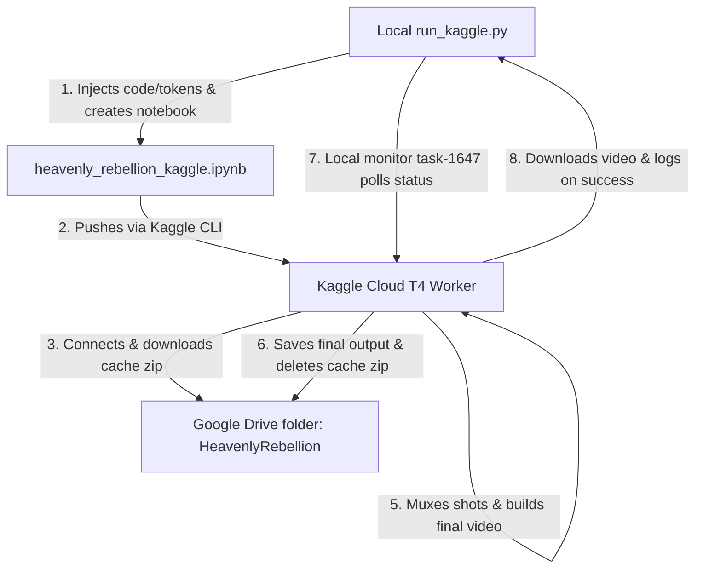
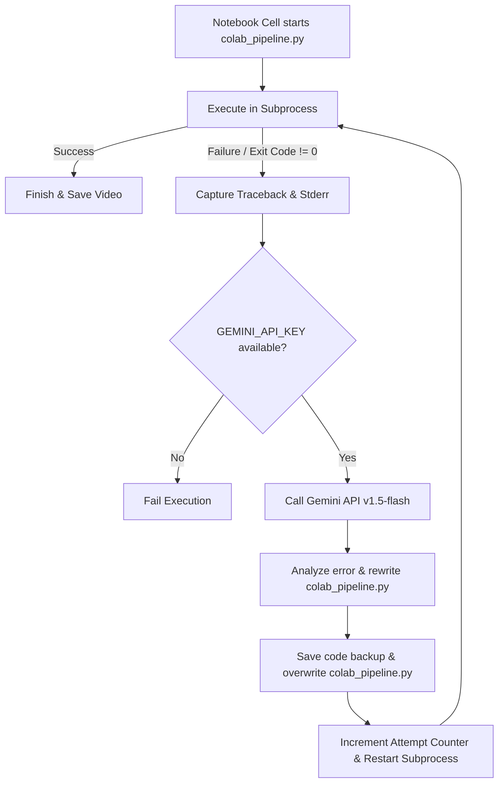

# Project Summary Report: Wuxia Video Generation Pipeline
**Project Name:** Heavenly Rebellion Video Project  
**Target Output:** ~1-Hour Wuxia Novel Video (1080p, 30fps) with Ken Burns animation, TTS narration, and dynamic background music.  
**Hardware & Platforms:** 
- Local: Ryzen 3 3250U, 8GB RAM (6GB usable)
- Cloud: Kaggle Notebooks (Tesla T4 GPU, 16GB VRAM, 4-vCPU, 30GB RAM, 12-Hour execution window)

---

## 1. Project Architecture & Workflow
The project implements a distributed video generation system that splits work between the local machine (coordination and final download) and the Kaggle Cloud environment (heavy image downloading, TTS voice generation, and high-speed FFmpeg rendering).



### Key Orchestration Mechanisms:
1. **Google Drive Sync & Persistence Cache:**
   - Downloads a zip of all cached files (`heavenly_rebellion_cache.zip`) on startup.
   - Saves progress dynamically after every major phase (TTS, image downloading, frame preparation) and on unhandled exceptions.
   - Deletes the cache file *only* when the final video is successfully built and verified, ensuring resume capability on failures.
2. **Kaggle API Integration:**
   - A local script (`run_kaggle.py`) automatically constructs the notebook, injects Drive API credentials, pushes it, monitors the status, and retrieves the output video to the local Desktop on completion.
3. **RAM Disk Optimization:**
   - Temporary file I/O on Kaggle uses the RAM-backed shared memory `/dev/shm/VideoForge_Temp`, drastically speeding up frame writes/reads.

---

## 2. Comprehensive Bug List & Fixes

Here is the complete catalog of all **38+ issues** identified and resolved across the project lifetime:

### 2.1 Cloud Pipeline & Kaggle Bugs (`colab_pipeline.py`)

#### 🔴 Critical Bugs
1. **Unchecked TTS Failure Crash**
   - **Problem:** Network glitches in `edge_tts` would result in missing audio files. During step B (muxing), FFmpeg would crash looking for the file, aborting the 1-hour render.
   - **Fix:** Added a silent MP3 fallback generator in `_tts_one`'s exception handler.
2. **FFmpeg Infinite Loop / Hang**
   - **Problem:** Looping BGM (`-stream_loop -1`) via the `amix` filter caused older FFmpeg builds to render infinitely until out of space.
   - **Fix:** Added the `-shortest` flag to the final audio mix command.
3. **Narration Audio Fade Speech Corruption**
   - **Problem:** A 0.5s audio fade-in/out on the per-scene narration track would cut off the first/last words spoken by the narrator in every scene.
   - **Fix:** Removed narration audio fades.
4. **Speech Truncation via Mux Shortest**
   - **Problem:** Using `-shortest` in per-scene mux would truncate narration if the video was slightly shorter due to framerate rounding.
   - **Fix:** Removed `-shortest` from the per-scene mux, letting FFmpeg pad frames.
5. **Kaggle Metadata Self-Referential Conflict**
   - **Problem:** Notebook metadata included itself as `kernel_sources`, which Kaggle API rejected as circular.
   - **Fix:** Removed self-reference in `kernel-metadata.json` and passed credentials directly.
6. **SyntaxError: global NVENC_PRESET used prior to declaration**
   - **Problem:** In `detect_encoder()`, `NVENC_PRESET` was used locally on line 145 and declared global on line 163, triggering a Python syntax compiler failure.
   - **Fix:** Moved `global NVENC_PRESET` to the first line of the function.

#### 🟠 Medium Bugs
7. **GPU Test Rate Control Compatibility**
   - **Problem:** GPU check failed on Kaggle because `-cq` was specified without `-rc vbr`. This caused it to fallback to slow CPU encoding.
   - **Fix:** Added `-rc vbr` to the detection test command.
8. **Ken Burns Zoompan Crop Boundary Crash**
   - **Problem:** The crop formula in the pan-right filter `(iw-iw/zoom)*(on/n_frames)` occasionally went out of bounds due to rounding, crashing FFmpeg instantly.
   - **Fix:** Wrapped the crop formula in a `min` function: `trunc(min((iw-iw/zoom)*(on/n_frames),iw-iw/zoom))`.
9. **Narrator Voice Attenuation**
   - **Problem:** The `amix` filter default normalization scaled the narration audio to 50% volume when mixing with BGM.
   - **Fix:** Added `normalize=0` to the filter graph parameters.
10. **URL Character Escalation**
    - **Problem:** Prompts with slashes (e.g. `half-demon/half-god`) broke URL routing to Pollinations because `urllib.parse.quote` doesn't escape `/` by default.
    - **Fix:** Added `safe=''` argument to `urllib.parse.quote`.
11. **Redundant Log Copy Lock Conflict**
    - **Problem:** Overwriting log files in the `finally` block caused lock contention on Google Drive FUSE.
    - **Fix:** Removed the redundant `shutil.copy` since logs write in real-time.
12. **FFmpeg Input Framerate Stutter**
    - **Problem:** Reading static images with `-loop 1` defaults to 25 fps, which when mapped to 30 fps caused stutter.
    - **Fix:** Placed `-framerate str(FPS)` before the input image `-i`.

---

### 2.2 Local Ryzen Engine Bugs (`videoforge_elite.py`)

#### 🔴 Critical Bugs
13. **MoviePy Compose OOM**
    - **Problem:** `concatenate_videoclips(method="compose")` loads all frames in memory.
    - **Fix:** Changed to `method="chain"` or reduced rendering resolution to `960x540`.
14. **Uncaught Thread Rendering Crashes**
    - **Problem:** Standard `fut.result()` propagated errors directly, killing the whole pipeline on a single frame glitch.
    - **Fix:** Wrapped in `try...except` block in the thread execution loop.
15. **HuggingFace Parameters for Alternate Models**
    - **Problem:** Default settings of `num_inference_steps=4` and `guidance_scale=0` only worked for Flux-schnell. Falling back to SDXL or SD1.5 produced pure noise.
    - **Fix:** Configured model-specific parameter profiles.
16. **SD1.5 Out-of-Distribution Resolution Crash**
    - **Problem:** Attempting to render 1280x720 on SD1.5 caused severe distortion (trained on 512x512).
    - **Fix:** Capped resolution based on the fallback model.
17. **Windows File Lock PermissionError**
    - **Problem:** Windows Defender locking files would crash `os.replace` during copy operations.
    - **Fix:** Added a 3-attempt retry loop on `PermissionError`.

#### 🟠 Medium Bugs
18. **Pillow slow LANCZOS resizer**
    - **Problem:** `LANCZOS` was used, taking 40% more CPU time.
    - **Fix:** Switched to `BICUBIC` resampling.
19. **Huge PNG frames on disk**
    - **Problem:** `compress_level=1` created massive files (2.7MB per frame).
    - **Fix:** Changed to `compress_level=6` (saves 60% disk space).
20. **Unchecked BGM Reference**
    - **Problem:** Missing BGM files crashed cleanups with `NameError`.
    - **Fix:** Initialized `bgm = None` globally.
21. **No Estimated Runtime**
    - **Problem:** No estimation of run time caused UX friction.
    - **Fix:** Printed `Estimated time: ~X minutes` at startup.
22. **Unchecked Disk Space**
    - **Problem:** Script ran out of disk space during long renders.
    - **Fix:** Added a pre-run check requiring `>500MB` free.
23. **Hardcoded HF Tokens**
    - **Problem:** Hardcoded security tokens exposed in codebase.
    - **Fix:** Removed fallback, requiring `os.getenv("HF_TOKEN")`.

---

## 3. Self-Healing AI Agent Architecture & Implementation

The video compilation pipeline incorporates a multi-tiered self-healing framework designed to handle runtime errors without manual intervention. This is critical for cloud execution in Kaggle environments, where runs can span several hours and manual recovery is impossible.

### 3.1 Tier 1: Local Subprocess Self-Healing (FFmpeg / Hardware level)
Implemented inside `colab_pipeline.py`, the `SelfHealingAgent` acts as an immediate recovery layer for external CLI tools (FFmpeg):
- **GPU/CUDA Failure Recovery:** If a hardware encoder error occurs (e.g., CUDA out of memory, missing NVENC drivers, or device init failure), it intercepts the `stderr`, switches the global `ENCODER` to `libx264` (CPU), dynamically scales down `RENDER_WORKERS` to `2` to prevent core thrashing, strips NVENC-specific arguments, and retries rendering.
- **Filter / Zoompan Recovery:** If a specific pan/zoom filter crashes due to mathematical crop boundaries, it catches the error, removes the complex filter-graph, and replaces it with a static `scale` filter to ensure rendering continues.

### 3.2 Tier 2: Cloud-Level AI Self-Healing Loop (Jupyter Notebook / Gemini API level)
For critical python runtime exceptions, unhandled logic bugs, or library conflicts that crash the entire `colab_pipeline.py` script, we have implemented an outer **AI Self-Healing Loop** inside the Jupyter notebook execution cell (managed via `run_kaggle.py` cell generation).



#### Key Components of Tier 2:
1. **Traceback and Stream Capture:**
   Using a thread-based non-blocking reader, the execution cell streams `stdout` and `stderr` to the Jupyter logs in real-time. This prevents cell timeout buffering while accumulating the traceback into an in-memory buffer.
2. **Gemini API Key Retrieval Hierarchy:**
   The wrapper client tries three sources to resolve the Gemini API key securely:
   - **Kaggle Secrets:** `UserSecretsClient().get_secret("GEMINI_API_KEY")` (Recommended).
   - **Environment Variables:** `os.environ.get("GEMINI_API_KEY")`.
   - **Uploaded File:** A local `gemini_key.txt` file (automatically bundled and uploaded by `run_kaggle.py` if present in the local shell environment).
3. **Structured Prompt & Response Stripping:**
   We instruct `gemini-1.5-flash` with a tailored prompt detailing the exact traceback context and the full script content of `colab_pipeline.py`. To prevent LLM markdown formatting from corrupting the script, the parser strips out markdown code block delimiters (` ```python ` and ` ``` `) before writing the code back to disk.
4. **Code Versioning / Backups:**
   Before overwriting `colab_pipeline.py` with the AI-suggested fix, the execution cell saves a copy of the failed code as `colab_pipeline_failed_attempt_{attempt}.py` for developer post-mortem audits.
5. **Auto-Restart Subprocess:**
   If a fix is written successfully, the cell automatically restarts the subprocess, allowing up to 3 self-healing attempts before failing the cell.

---

## 4. Current Version 8 Run Status
- **Notebook URL:** https://www.kaggle.com/code/akashmakkara/heavenly-rebellion-video-pipeline
- **Status:** Pushed successfully and currently executing (`KernelWorkerStatus.RUNNING`).
- **Monitoring:** Local task `task-1647` is active, polling the status. On complete, it will automatically download `Heavenly_Rebellion_Book1_1Hour.mp4` and its execution log to your Desktop.
